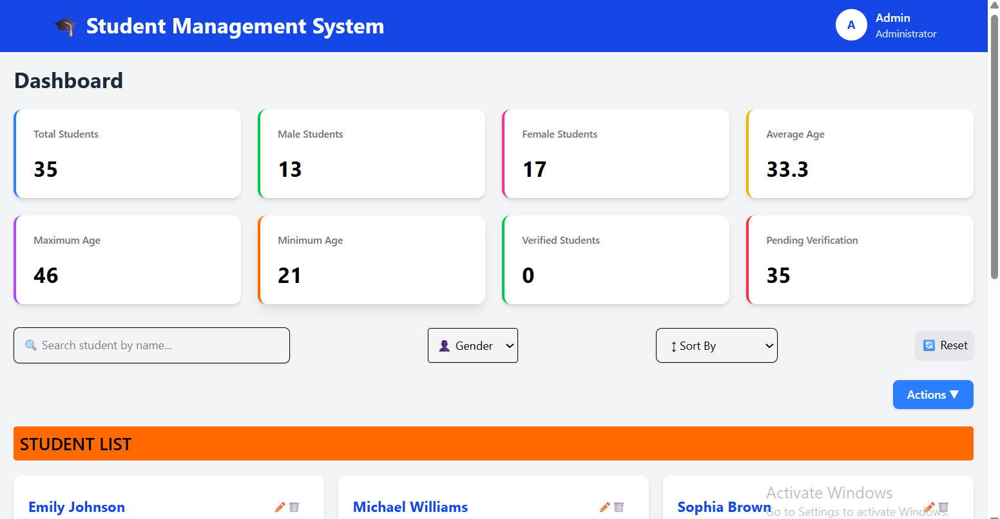

# 🎓 Student Management System

A modern **Student Management System** built with **React.js**, **Tailwind CSS**, **Axios**, and **DummyJSON API**. The application provides an intuitive dashboard for managing student records with CRUD operations, search, filtering, sorting, pagination, validation, and Local Storage persistence.

---

## 🚀 Features

- 📋 Display Student List
- ➕ Add New Student
- ✏️ Update Student Details
- ❌ Delete Student
- ✅ Verify Student
- 🔍 Search Students
- 📑 Pagination
- 📊 Dashboard Statistics
- 📦 Local Storage Persistence
- ✔️ Form Validation
- 🎨 Responsive UI
- ⚡ Fast Performance with Vite

---

## 🛠 Tech Stack

### Frontend
- React.js
- JavaScript (ES6+)
- Tailwind CSS
- HTML5
- CSS3

### API
- DummyJSON API
- Axios

### State Management
- React Hooks
- useState
- useEffect

### Storage
- Browser Local Storage

### Tools
- Git
- GitHub
- VS Code
- npm

---

## 📁 Project Structure

```text
src
│
├── api
├── assets
├── components
│   ├── Loader.jsx
│   ├── Navbar.jsx
│   ├── StatsCard.jsx
│   └── StudentForm.jsx
│
├── pages
│   ├── Dashboard.jsx
│   └── AddStudent.jsx
│
├── services
├── utils
│
├── App.jsx
├── main.jsx
└── index.css
```

---

## ⚙️ Installation

Clone the repository

```bash
git clone https://github.com/manvi2908/student-management-system.git
```

Move into project folder

```bash
cd student-management-system
```

Install dependencies

```bash
npm install
```

Start development server

```bash
npm run dev
```

---

## 📸 Screenshots

> Add screenshots here after deployment.

Example:

Dashboard



Student Form


---

## 🔮 Future Enhancements

- Import Students from CSV
- Export Students to CSV
- Excel Export
- Excel Import
- Authentication
- Dark Mode
- Charts & Analytics
- Backend Integration
- Cloud Database
- Role Based Access

---

## 📚 Learning Outcomes

Through this project I learned:

- React Component Architecture
- CRUD Operations
- API Integration using Axios
- State Management
- Form Validation
- Pagination
- Local Storage
- Error Handling
- Responsive UI Design
- Git & GitHub Workflow

---

## 👩‍💻 Author

**Manvi Goyal**

GitHub: https://github.com/manvi2908